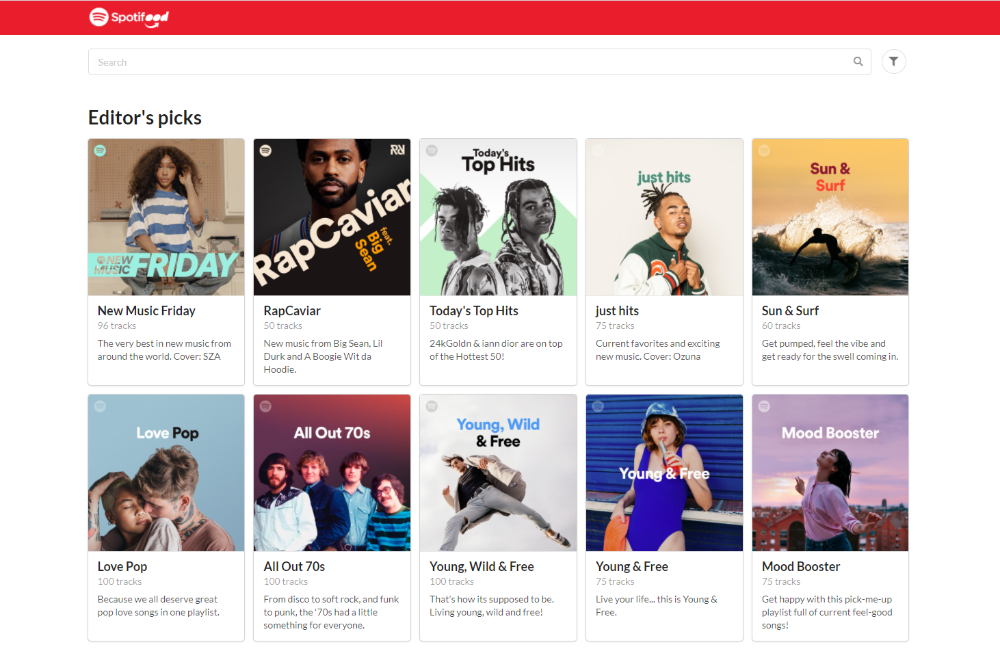

# Spotifood

We love food and music

This project was bootstrapped with [Create React App](https://github.com/facebook/create-react-app).

## Available Scripts

In the project directory, you can run:

`npm start`

Runs the app in the development mode.  
Open [http://localhost:3000](http://localhost:3000) to view it in the browser.

The page will reload if you make edits.  
You will also see any lint errors in the console.

`npm test`

Launches the test runner in the interactive watch mode.

`npm run build`

Builds the app for production to the `build` folder

## Technologies

- [React](https://reactjs.org/)
- UI Components
  - [Semantic UI React](https://react.semantic-ui.com)
  - [React Datepicker](https://reactdatepicker.com/)
- I18n
  - [Format.JS](https://formatjs.io/)
  - [date-fns](https://date-fns.org/)
- [axios](https://github.com/axios/axios)
- [React Router](https://reactrouter.com/)
- [styled-components](https://styled-components.com/)
- Test and Code style
  - Test runner - [Jest](https://jestjs.io/)
  - React test utility [Enzyme](https://enzymejs.github.io/enzyme/)
  - Test assertion - [Chai](https://www.chaijs.com/)
  - Eslint base config - [eslint-config-airbnb](https://www.npmjs.com/package/eslint-config-airbnb)
  - Code formatter - [prettier](https://prettier.io/)

## Environment variable

**REACT_APP_SPOTIFY_CLIENT_ID**

Spotify **client_id**, used for integration with spotify

**REACT_APP_SPOTIFY_REDIRECT_URI**

Spotify **redirect_uri**, this is actually the app's URI

> these variables have default values for the development environment

## Known Issues

- [findDOMNode is deprecated in StrictMode](https://github.com/Semantic-Org/Semantic-UI-React/issues/3810)
- FIlter by country USA does not work
- Session is not kept between tabs

## What comes next?

- Add pagination in playlists
- Keep session between tabs
- Change Semantic UI theme properly
- Add support to change the application language, currently the browser language is used
- CI/CD configuration
