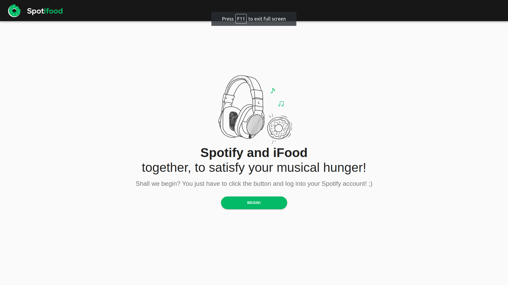
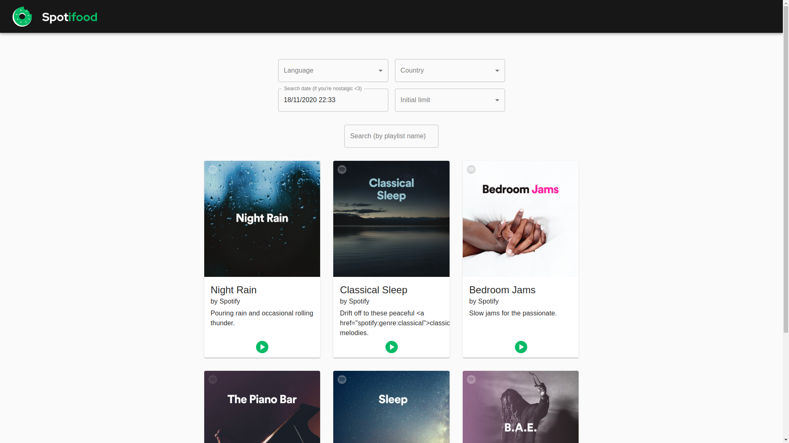

# Spotifood

This web application uses Spotify's API to list their featured playlists, each one with it's image, title, owner, description and a button to open it on the Spotify Web Player. The playlists are shown on a infinite scroll, which is incremented by the order of 6 itens per request, until there is no more data to receive.

The playlists can be recovered using four different filters, which can be freely used between each other:
- Country: to list the playlists from a specific country;
- Language: to show the retrieved information in a specific language (if available);
- Timestamp: the Timestamp from which the playlists will be recovered;
- Limit: the limit of playlists recovered on a single endpoint call.

Additionally, after the playlist's list is filled, it is possible to filter it by the playlist names.

Also, the Spotify's API is called once every 30 seconds, to provide the user with the most recent data.

## Used resources
To develop this web application, the following tecnologies and components were used:

- [ReactJS Hooks](https://reactjs.org/)
- [React Router](https://reactrouter.com/)
- [Redux](https://redux.js.org/)
- [Axios](https://www.npmjs.com/package/axios)
- [Material UI](https://material-ui.com/)
- [React Infinite Scroll Component](https://www.npmjs.com/package/react-infinite-scroll-component)

## How-To
To run the application, clone it to your machine, then execute the command `npm install` or `yarn install` to install all the dependencies (personally I like yarn more, since it is faster than npm, specially when running on windows, but it is up to you).
Then, when it finishes, execute the command `npm start` or `yarn start` (based on how you installed all the dependencies.

## Additional notes
- Initially I planned on use [styled-components](https://styled-components.com/) to do the UI, but due time constraints (mainly because I'm on a project delivery period on my current job) I've scratched that out and opted to continue the development using a [Material UI template](https://v3.material-ui.com/getting-started/page-layout-examples/album/), adapting and enhancing it to my needs.
- Even though this is a small app, I've chose to use [Redux](https://redux.js.org/) for state management because I've considered a real life scenario, where this app would probably get additional functionalities in the future. It is easier to set-up the whole Redux structure from the beginning than using a different approach (i.e. Context API) and migrating later. This happened to me on another application I've worked on and it was quite consuming refactor from one to another.
- The Spotify API authentication method I've used is not ideal, since it only provides me a access token that is valid for 60 minutes and it is not refreshable, but unfortunately I found out other ways to authenticate near the delivery due date of this case, but it is definitely a point to improve.
- I've opted to ask for the user authentication prior the use of the application for two reasons: 1) It was the way I found to get the access token (early on, while developing the main functionalities); and 2) It allows the user to access the playlist directly on the Spotify Web Player without having to authenticate when trying to play a song (which personally I think it is more frustrating).
- Due a Filters API error, the United States data value is "en_US" instead of following the **[ISO 3166-1 Standard](https://en.wikipedia.org/wiki/ISO_3166-1 "ISO 3166-1")** two letters country codes as the other coutnries returned do. To avoid the wrong information to be passed to the API (which causes an error 400), the correct value was hard-coded.
- To make the whole application on English, and to make it more user friendly, the country and locale names were also updated to be used on the text labels.

## Images
This is the landing page, which have a friendly message and the button used to log into Spotify.

After the log in, the main page is shown, with the system current timestamp already inputted on the filtes, to retrieve the most updated information from Spotify's API.
