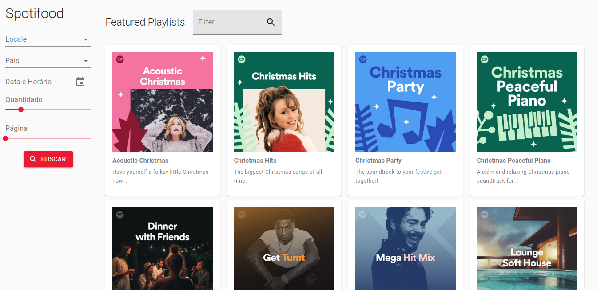

# iFood Frontend Test

This project is built in with:

- [CRA (Create React App)](https://github.com/facebook/create-react-app)
- [Next.js to serve SSR](https://nextjs.org/docs)
- [Material UI Framework](https://material-ui.com/pt/)
- State management with [Redux](https://redux.js.org/) + Redux Saga
- [ESlint](https://eslint.org/) and [Prettier](https://prettier.io/) to stardardize code style
- [Travis CI](https://travis-ci.com/)

Demo: <https://spotifood-test.herokuapp.com/>

## Available Scripts

In the project directory, you can run:

Development mode:

`yarn dev`

Local server will be started at <http://localhost:3000>

Tests:

`yarn test`

Build:

`yarn build`

## Deployment

Deploys application to Heroku after pipeline success

`yarn deploy`

After publishing, a demo will be available at <https://spotifood-test.herokuapp.com/>.
